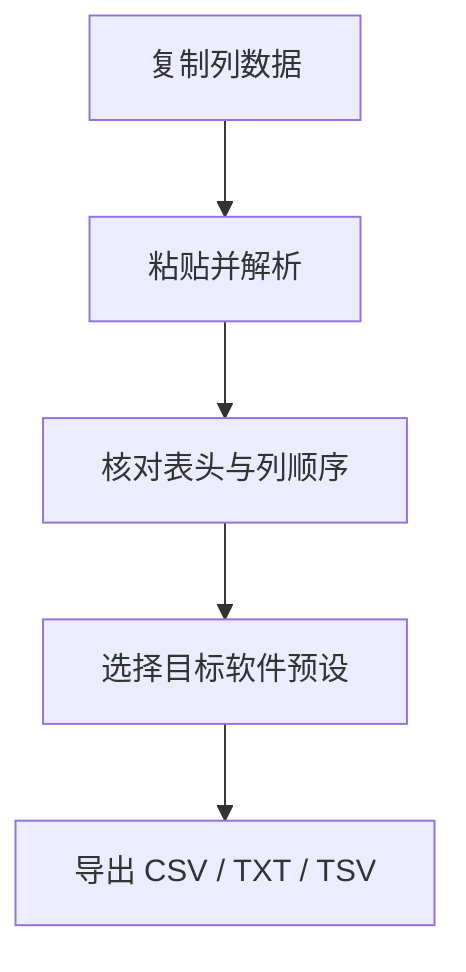

# PasteFlow

**把复制来的列数据整理成规则表格，再导出给 Origin、Excel、Python 或 MATLAB。**

PasteFlow is a local Tkinter desktop tool for parsing clipboard tables, checking columns, and exporting CSV, TXT, or TSV with the encoding expected by your next tool.

[Windows 下载](https://github.com/D-sudoasd/PasteFlow/releases/latest) · [操作步骤](#使用-gui) · [格式与编码](#目标软件与格式) · [源码运行](#从源码开发)

[](LICENSE)



**最短使用路径：** 下载并打开程序 → 粘贴 → 检查预览 → 导出。源码版在仓库目录运行 `py csv_paste_exporter.py`，运行时只依赖 Python 标准库与 Tkinter。

例如，粘贴含 `2theta` 和 `intensity` 的两列表格，启用“第一行是表头”，即可保留这两个列名导出。第一行默认作为数据；是否启用表头由使用者决定。程序整理表格，不改变单位或进行拟合。

## 能力

- 自动识别制表符、逗号、分号或空白分隔
- 去掉空行/空列，补齐参差不齐的行
- 保留表头、单位、科学计数法与原始文本
- 列删除 / 重排；可恢复原始解析结果
- 快速 X/Y 图预览与导出就绪检查
- 目标预设：Excel、Origin、Python/pandas、MATLAB、旧仪器/GBK
- 编码：UTF-8 BOM、UTF-8、GBK

窗口标题为 **「CSV 列数据整理导出」**。设置保存在 `%APPDATA%\CsvPasteExporter\settings.json`。默认：**第一行是数据**，勾选「第一行是表头」后才当表头。

## 目标软件与格式

与应用内 **目标软件** 预设一致。TSV 可从 **格式**（或 **自定义**）选择。

| 目标 | 格式 | 编码 |
| --- | --- | --- |
| Excel | CSV | UTF-8 BOM |
| Origin | TXT（制表符） | UTF-8 BOM |
| Python / pandas | CSV | UTF-8 |
| MATLAB | CSV | UTF-8 |
| 旧仪器/GBK | TXT（制表符） | GBK |

## 下载

**[Latest Release](https://github.com/D-sudoasd/PasteFlow/releases/latest)** — Windows EXE，无需安装 Python。带标签的安装包可能落后于 `main`；要当前 GUI / 预设 / 图表，请用下方源码运行。

## 使用 GUI

1. 从 Origin / Excel / 仪器软件复制若干列  
2. 点 **粘贴剪贴板**（或粘贴到 **粘贴区**）  
3. 可选：**第一行是表头**、**目标软件**  
4. 看 **预览**；改粘贴区后用 **整理预览**  
5. 可选：**删除选中列** / **上移列** / **下移列** / **恢复原始数据**  
6. **导出** → CSV / TXT / TSV（UTF-8 BOM / UTF-8 / GBK）

**清空** 会清掉粘贴区与预览。

## 范围与边界

| 做 | 不做 |
| --- | --- |
| 剪贴板表格解析与矩形化 | 科学计算、拟合、单位换算 |
| 导出给下游软件的干净分隔文件 | 读取专有 Origin / Excel 工程文件 |
| 简易 X/Y 预览 | 出版级作图或批处理管线 |
| 本地桌面工具 | 网络服务或云同步 |

解析启发式（分隔符优先级、空行处理等）面向常见科研剪贴板；极端混乱文本仍可能需要人工整理。工具不修改剪贴板来源文件。

## 从源码开发

运行时只需 **Python 标准库 + Tkinter**。开发依赖见 `requirements-dev.txt`：

```powershell
py -m pip install -r requirements-dev.txt
py csv_paste_exporter.py
py -m pytest -q
```

打包无边框 EXE：

```powershell
py -m PyInstaller --noconfirm --clean --onefile --windowed --name "CSV列数据整理导出" --distpath "dist" --workpath "build" --specpath "build" "csv_paste_exporter.py"
```

单文件入口：`csv_paste_exporter.py`。测试：`tests/test_csv_paste_exporter.py`。

## License

[MIT](LICENSE)
